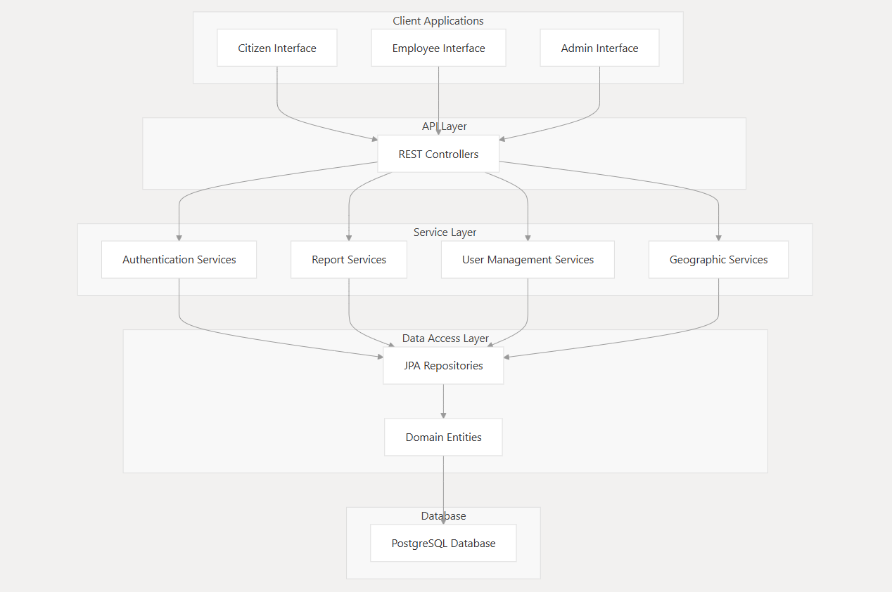

# CivicEye: Civic Issue Reporting and Management System

**CivicEye** is a Spring Boot-based backend application that empowers citizens to report civic issues—such as infrastructure problems and public service disruptions—directly to municipal authorities. The platform ensures efficient routing and resolution of reports through a structured administrative hierarchy and geographic organization.

---

## 🧭 Purpose and Scope

CivicEye aims to improve communication and problem-solving between citizens and local governments by providing:

- 🧑‍🤝‍🧑 Citizens: A simple way to submit and track reports in their communities
- 👷 Employees: Tools to manage and resolve assigned reports
- 🏛️ Administrators (City, Governorate, Master): System oversight and management at different levels

---

## 🏗️ System Architecture

The project follows a layered architecture:



- **Database Layer:** PostgreSQL
- **Data Access Layer:** JPA Repositories
- **Service Layer:** Business logic (e.g., report routing, user handling)
- **API Layer:** REST controllers using Spring Boot
- **Client Interfaces:**
    - Citizen Interface
    - Employee Interface
    - Admin Interface

---

## 🔐 Authentication and Security

- JWT-based authentication
- Role-based access control
- Secure HTTP-only cookies for storing tokens

---

## 👥 User Management

- Supports **Citizens**, **Employees**, and **Administrators**
- Multi-level administration (City → Governorate → Master)
- User profile creation and management

---

## 📝 Report Management

- Submit, assign, track, and resolve civic reports
- Workflow stages:  
  `Submit → Assign → Process → Review → Resolve → Close`
- Employees are assigned reports based on location and role

---

## 🌍 Geographic Organization

- Two-tier hierarchy: **Governorate → City**
- Location-based routing of reports
- Administrative control aligned with geographic boundaries

---

## 🧰 Technology Stack

| Component         | Technology                |
|------------------|---------------------------|
| Framework        | Spring Boot 3.4.2         |
| Database         | PostgreSQL                |
| Security         | Spring Security, JWT      |
| API Docs         | SpringDoc OpenAPI (Swagger) |
| Build Tool       | Maven                     |
| Java Version     | Java 21                   |
| Testing Utilities| JavaFaker, Lombok         |

---

## 🚀 Getting Started

### Prerequisites

- Java 21+
- Maven 3.6+
- PostgreSQL

### Installation

```bash
git clone https://github.com/eng-yousef-hesham/Graduation-Project-Back-End.git
cd Graduation-Project-Back-End
mvn clean install
mvn spring-boot:run
```
## 📖 API Documentation

Visit Swagger UI after starting the app:  
[http://localhost:9090/swagger-ui/index.html](http://localhost:9090/swagger-ui/index.html)

---

## 🔑 User Roles and Permissions

- **Citizen:** Register and submit reports
- **Employee:** Handle assigned reports and update statuses
- **City Admin:** Manage city-level users and services
- **Governorate Admin:** Oversee cities and staff within the governorate
- **Master Admin:** Full system-level access and control

---

## 🔄 Report Workflow

1. **Submit:** Citizen reports an issue
2. **Assign:** System assigns it to a suitable employee
3. **Process:** Work on the issue begins
4. **Review:** Supervisor verifies the progress
5. **Resolve:** Issue marked as resolved
6. **Close:** Report is officially closed after verification

---

## ✅ Testing

Run the unit and integration tests with:

```bash
mvn test
